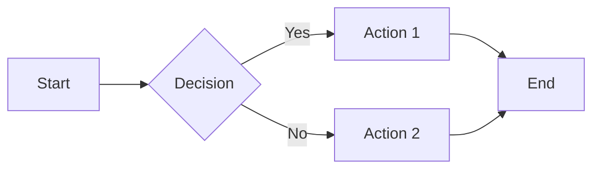

# Documentation Site Template

Welcome to your MkDocs-powered documentation site! This is the homepage of your documentation built using [MkDocs](https://www.mkdocs.org/) with the [Material theme](https://squidfunk.github.io/mkdocs-material/).

## Getting Started

### Prerequisites

Before you begin, make sure you have:

- Python 3.8 or higher installed
- Git configured with your repository
- Basic knowledge of Markdown

### Quick Setup

1. **Clone or download this template**
2. **Navigate to your project directory**
3. **Run the setup script**: `./init_site.sh`

That's it! Your documentation site will be built and served locally at `http://127.0.0.1:8000`.

### Manual Setup (Alternative)

If you prefer to set things up manually:

#### 1. Create Virtual Environment

```bash
python3 -m venv .venv
source .venv/bin/activate
```

#### 2. Install Dependencies

```bash
pip install -r requirements.txt
```

#### 3. Configure Your Site

Edit the configuration files in the `mkdocs/` directory:

| Configuration File           | Description                   |
| ---------------------------- | ----------------------------- |
| **01-mkdocs-site.yml**       | Basic site information        |
| **02-mkdocs-theme.yml**      | Theme and appearance settings |
| **03-mkdocs-extra.yml**      | Social links and extras       |
| **04-mkdocs-plugins.yml**    | Plugin configurations         |
| **05-mkdocs-extensions.yml** | Markdown extensions           |
| **06-mkdocs-nav.yml**        | Navigation structure          |

#### 4. Build Configuration

```bash
cat mkdocs/*.yml > mkdocs.yml
```

#### 5. Start Development Server

```bash
mkdocs serve
```

## Adding and Organizing Content

### Creating New Pages

To add content to your documentation:

1. **Create new Markdown files** in this `Labs/` directory
2. **Add them to the navigation** in `mkdocs/06-mkdocs-nav.yml`

Example navigation entry:

```yaml
nav:
  - Home: README.md
  - Getting Started: getting-started.md
  - Your New Page: your-new-page.md
```

### Content Organization Structure

Here's how you might organize your documentation:

```text
Labs/
├── README.md              # This homepage
├── tutorials/             # Tutorial section
│   ├── README.md         # Tutorial overview
│   ├── basic-tutorial.md
│   └── advanced-tutorial.md
├── guides/                # How-to guides
│   ├── README.md         # Guides overview
│   └── installation-guide.md
├── reference/             # Reference documentation
│   ├── README.md         # Reference overview
│   ├── api-reference.md
│   └── configuration.md
└── assets/               # Images and other assets
    ├── images/
    │   ├── logo.png
    │   └── screenshots/
    └── stylesheets/
```

### Adding Images and Assets

1. **Place images** in `Labs/assets/images/`
2. **Reference them** in your Markdown:

```markdown

```

3. **Add custom stylesheets** to the `Labs/assets/stylesheets/` directory

## Customization

### Changing Theme Colors

Edit `mkdocs/02-mkdocs-theme.yml` to customize the appearance:

```yaml
theme:
  palette:
    primary: blue  # Change to your preferred color
```

Available colors: red, pink, purple, deep purple, indigo, blue, light blue, cyan, teal, green, light green, lime, yellow, amber, orange, deep orange, brown, grey, blue grey

### Adding Custom CSS

1. **Create CSS files** in `Labs/assets/stylesheets/`
2. **Reference them** in `mkdocs/03-mkdocs-extra.yml`:

```yaml
extra_css:
  - ./assets/stylesheets/custom.css
```

## Template Features

This documentation template includes many powerful features:

### Markdown Extensions

- **Admonitions**: Create beautiful callout boxes
- **Code highlighting**: Syntax highlighting for code blocks
- **Tables**: Enhanced table formatting
- **Mermaid diagrams**: Create flowcharts and diagrams
- **Math notation**: LaTeX-style mathematical expressions

### Navigation Features

- **Tabs**: Top-level navigation tabs
- **Search**: Fast client-side search
- **Table of contents**: Automatic TOC generation
- **Navigation sections**: Collapsible navigation sections

### Code Examples

Here's a code block with syntax highlighting:

```python
def hello_world():
    """A simple hello world function."""
    print("Hello, World!")
    return "Hello, World!"

# Call the function
hello_world()
```

### Admonitions

MkDocs Material supports many different types of admonitions. Here are all the available types:

!!! note "Note"
    This is a note admonition. Use it to highlight important information.
    
    ```markdown
    !!! note "Note"
        Your content here
    ```

!!! abstract "Abstract/Summary/TL;DR"
    This is an abstract admonition. Great for summaries or TL;DR sections.
    
    ```markdown
    !!! abstract "Abstract"
        Your summary here
    ```

!!! info "Info/Todo"
    This is an info admonition. Use it for informational content.
    
    ```markdown
    !!! info "Info"
        Your information here
    ```

!!! tip "Tip/Hint"
    This is a tip admonition. Perfect for sharing helpful hints and best practices!
    
    ```markdown
    !!! tip "Tip"
        Your helpful tip here
    ```

!!! success "Success/Check/Done"
    This is a success admonition. Use it to highlight successful outcomes or completed tasks.
    
    ```markdown
    !!! success "Success"
        Your success message here
    ```

!!! question "Question/Help/FAQ"
    This is a question admonition. Great for FAQs or help sections.
    
    ```markdown
    !!! question "Question"
        Your question or FAQ here
    ```

!!! warning "Warning/Caution/Attention"
    This is a warning admonition. Use it to call attention to potential issues.
    
    ```markdown
    !!! warning "Warning"
        Your warning message here
    ```

!!! failure "Failure/Fail/Missing"
    This is a failure admonition. Use it to highlight failures or missing items.
    
    ```markdown
    !!! failure "Failure"
        Your failure message here
    ```

!!! danger "Danger/Error"
    This is a danger admonition. Reserve for critical warnings and errors.
    
    ```markdown
    !!! danger "Danger"
        Your critical warning here
    ```

!!! bug "Bug"
    This is a bug admonition. Perfect for documenting known issues.
    
    ```markdown
    !!! bug "Bug"
        Your bug description here
    ```

!!! example "Example"
    This is an example admonition. Use it to provide code examples or demonstrations.
    
    ```markdown
    !!! example "Example"
        Your example content here
    ```

!!! quote "Quote/Cite"
    This is a quote admonition. Use it for citations or important quotes.
    
    ```markdown
    !!! quote "Quote"
        Your quote or citation here
    ```

#### Collapsible Admonitions

You can make admonitions collapsible by using `???` instead of `!!!`:

??? note "Collapsible Note (Click to expand)"
    This admonition starts collapsed. Users can click to expand it.
    
    ```markdown
    ??? note "Collapsible Note"
        Hidden content here
    ```

???+ tip "Collapsible but Open by Default"
    This admonition is collapsible but starts expanded. Use `???+` for this behavior.
    
    ```markdown
    ???+ tip "Open Collapsible"
        Content visible by default
    ```

#### Inline Admonitions

You can also create inline admonitions that flow with the text:

!!! info inline "Inline Info"
    This is an inline admonition that takes up less space.

!!! tip inline end "Inline at End"
    This inline admonition is positioned at the end of the line.

Regular text continues here, flowing around the inline admonitions above.

```markdown
!!! info inline "Inline Info"
    Inline admonition content

!!! tip inline end "Inline at End"  
    End-positioned inline content
```

#### Custom Titles

You can customize the title or remove it entirely:

!!! warning ""
    This admonition has no title - just leave the quotes empty.

!!! success "🎉 Custom Title with Emoji"
    You can use emojis and custom text for titles.

```markdown
!!! warning ""
    No title admonition

!!! success "🎉 Custom Title with Emoji"
    Custom titled content
```


### Mermaid Diagram Example



## Deployment

### GitHub Pages (Recommended)

1. **Push your repository to GitHub**
2. **Enable GitHub Pages** in repository settings
3. **Use GitHub Actions** for automatic deployment

### Manual Deployment

Deploy your site manually using:

```bash
mkdocs gh-deploy
```

This will build and deploy your site to GitHub Pages automatically.

## Next Steps and Resources

1. **Customize the site configuration** in the `mkdocs/` directory
2. **Add your own content** by creating new Markdown files
3. **Update the navigation** to reflect your content structure
4. **Deploy your site** to GitHub Pages or your preferred hosting platform

### Learning Resources

- **Explore** the [Material theme documentation](https://squidfunk.github.io/mkdocs-material/)
- **Learn about** [MkDocs plugins](https://github.com/mkdocs/mkdocs/wiki/MkDocs-Plugins)
- **Check out** [Markdown extensions](https://python-markdown.github.io/extensions/)

Happy documenting! 📚✨
