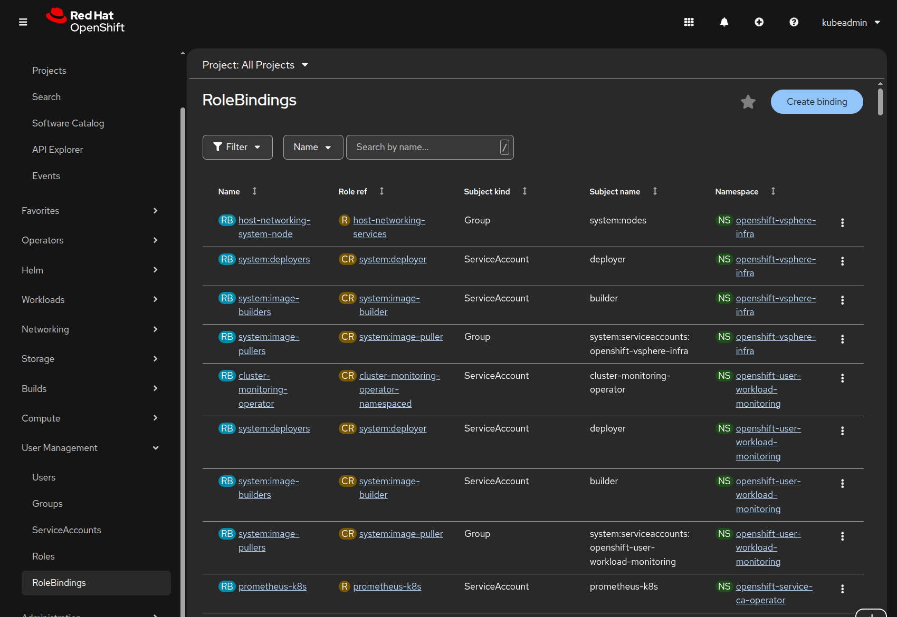

# Lab 002: Understanding Roles and Permissions (RBAC)

## Overview

This lab covers Role-Based Access Control (RBAC) in OpenShift, including roles, role bindings, and permission management using both CLI and web console.

## Prerequisites

- Completed [Lab 001: Verify Cluster Health](../001-verify-cluster/README.md)
- OpenShift Local (CRC) running
- Access to both `developer` and `kubeadmin` users

---

## Lab Instructions

### Step 1: Understanding RBAC Components

RBAC stands for Role-Based Access Control. \
It controls who can perform which actions on what resources in OpenShift.

#### **Key Components:**

| Component | Scope | Description |
|-----------|-------|-------------|
| **Role** | Namespace | Defines permissions within a single project |
| **ClusterRole** | Cluster-wide | Defines permissions across all projects |
| **RoleBinding** | Namespace | Grants Role permissions to users/groups in a project |
| **ClusterRoleBinding** | Cluster-wide | Grants ClusterRole permissions to users/groups cluster-wide |

---

#### **Common Built-in Roles:**

| Role | Permissions |
|------|-------------|
| `view` | Read-only access to most resources |
| `edit` | Create, modify, and delete resources (not permissions) |
| `admin` | Full control including managing roles (within project) |
| `cluster-admin` | Full cluster control (all projects and cluster resources) |

---

### Step 2: Understanding Permission Scopes

In OpenShift, permissions work at two levels: **cluster-wide** and **project-specific**. This is crucial to understand before exploring RBAC.

#### Cluster-Wide vs Project-Specific

- **Cluster-wide permissions**: Apply to all projects and cluster resources (nodes, cluster operators, etc.)
- **Project-specific permissions**: Apply only within a single project/namespace

A user can have different permissions at each level. For example:

- Limited cluster permissions (can't modify cluster settings)
- Full admin rights within their own projects

Let's explore this with the developer user.

#### Check Your Current Context

Log in as the developer user:

```bash
oc login -u developer -p developer https://api.crc.testing:6443
```

Check your current user and project:

```bash
oc whoami
oc project
```

Expected output:

```text
developer
Using project "lab-000-setup" on server "https://api.crc.testing:6443".
```

You're logged in as `developer` and currently in the `lab-000-setup` project (created in Lab 000).

#### Test Cluster-Wide Permissions

The `oc auth can-i` command checks if you have permission to perform an action. \
Let's test cluster-wide permissions:

```bash
oc auth can-i create pods --all-namespaces
```

Expected output:

```text
no
```

**Why "no"?** Creating pods across all namespaces requires cluster-level permissions. The developer user doesn't have this.

Try more cluster-level checks:

```bash
oc auth can-i create projects
oc auth can-i delete clusterroles
oc auth can-i get nodes
```

Expected output:

```text
yes
no
no
```

**Analysis:**

- ✓ Can create new projects (this is allowed for developers in CRC)
- ✗ Cannot delete cluster roles (cluster admin only)
- ✗ Cannot view nodes (infrastructure management)

#### Test Project-Specific Permissions

Now check permissions within your current project (lab-000-setup):

```bash
oc auth can-i create pods
oc auth can-i create deployments
oc auth can-i delete pods
```

Expected output:

```text
yes
yes
yes
```

**Why "yes"?** When you created the `lab-000-setup` project in Lab 000, you automatically received the `admin` role for that project.

Test permission management:

```bash
oc auth can-i create rolebindings
oc auth can-i delete rolebindings
```

Expected output:

```text
yes
yes
```

**Why does this matter?** The `admin` role lets you manage permissions within your project, including granting access to other users.

#### The Key Insight

The same command (`oc auth can-i create pods`) returns different results depending on scope:

| Command | Result | Reason |
|---------|--------|--------|
| `oc auth can-i create pods --all-namespaces` | **no** | No cluster-wide permission |
| `oc auth can-i create pods` (in your project) | **yes** | Admin in this specific project |

This demonstrates **project isolation**: you can be an admin in your own projects while having limited cluster access.

---

### Step 3: Create a Test Project

Create a new project (similar to Lab 000, but now we'll examine the RBAC implications):

```bash
oc new-project rbac-demo
```

Expected output:

```text
Now using project "rbac-demo" on server "https://api.crc.testing:6443".

You can add applications to this project with the 'new-app' command...
```

Check your permissions in this project:

```bash
oc auth can-i create pods -n rbac-demo
oc auth can-i create deployments -n rbac-demo
oc auth can-i create rolebindings -n rbac-demo
```

Expected output:

```text
yes
yes
yes
```

As project creator, you automatically get `admin` role in your project.

View your role binding:

```bash
oc get rolebindings -n rbac-demo
```

Expected output:

```text
NAME                    ROLE                               AGE
admin                   ClusterRole/admin                  1m
system:deployers        ClusterRole/system:deployer        1m
system:image-builders   ClusterRole/system:image-builder   1m
system:image-pullers    ClusterRole/system:image-puller    1m
```

Describe your admin binding:

```bash
oc describe rolebinding admin -n rbac-demo
```

Expected output:

```text
Name:         admin
Namespace:    rbac-demo
Labels:       <none>
Annotations:  <none>
Role:
  Kind:  ClusterRole
  Name:  admin
Subjects:
  Kind  Name       Namespace
  ----  ----       ---------
  User  developer
```

---

### Step 4: Explore Built-in Roles

List all cluster roles:

```bash
oc get clusterroles
```

This shows many built-in roles. Let's examine the three most common ones: `view`, `edit`, and `admin`.

#### View Role - Read Only

```bash
oc describe clusterrole view | grep -A 3 "^PolicyRule:"
```

Expected output (partial):

```text
PolicyRule:
  Resources                                    Non-Resource URLs  Resource Names  Verbs
  ---------                                    -----------------  --------------  -----
  bindings                                     []                 []              [get list watch]
```

Notice the **Verbs**: `[get list watch]` - these are read-only operations.

#### Edit Role - Manage Resources

```bash
oc describe clusterrole edit | grep -A 3 "buildconfigs"
```

Expected output (partial):

```text
  buildconfigs                                 []                 []              [create delete deletecollection get list patch update watch]
```

Notice the **Verbs** now include: `[create delete patch update]` - you can modify resources.

Check if `edit` can manage permissions:

```bash
oc describe clusterrole edit | grep rolebindings
```

Expected output:

```text
(no output - edit cannot manage rolebindings)
```

#### Admin Role - Manage Resources AND Permissions

Check if `admin` can manage permissions:

```bash
oc describe clusterrole admin | grep rolebindings
```

Expected output:

```text
  rolebindings                                               []                 []              [create delete deletecollection get list patch update watch]
  roles.rbac.authorization.k8s.io                            []                 []              [create delete deletecollection get list patch update watch]
```

The `admin` role can manage `rolebindings` and `roles` - this is the key difference!

#### Summary of Role Differences

| Role | Read Resources | Modify Resources | Manage Permissions |
|------|---------------|------------------|-------------------|
| `view` | ✓ | ✗ | ✗ |
| `edit` | ✓ | ✓ | ✗ |
| `admin` | ✓ | ✓ | ✓ |
| `cluster-admin` | ✓ | ✓ | ✓ (cluster-wide) |

**Key Insight:** The progression is clear:

- `view` → can only read
- `edit` → can read and modify resources
- `admin` → can read, modify resources, AND grant access to others
- `cluster-admin` → can do everything, everywhere

---

### Step 5: Grant Permissions to Another User

Switch to kubeadmin (cluster admin):

```bash
oc login -u kubeadmin -p $(cat ~/.crc/machines/crc/kubeadmin-password) https://api.crc.testing:6443
```

Create another test project:

```bash
oc new-project team-project
```

Grant developer user `edit` role in this project:

```bash
oc adm policy add-role-to-user edit developer -n team-project
```

Expected output:

```text
clusterrole.rbac.authorization.k8s.io/edit added: "developer"
```

View the role binding:

```bash
oc get rolebinding -n team-project
```

Expected output:

```text
NAME                    ROLE                               AGE
admin                   ClusterRole/admin                  14s
edit                    ClusterRole/edit                   7s
system:deployers        ClusterRole/system:deployer        14s
system:image-builders   ClusterRole/system:image-builder   14s
system:image-pullers    ClusterRole/system:image-puller    14s
```

Describe the edit binding:

```bash
oc describe rolebinding edit -n team-project
```

Expected output:

```text
Name:         edit
Namespace:    team-project
Labels:       <none>
Annotations:  <none>
Role:
  Kind:  ClusterRole
  Name:  edit
Subjects:
  Kind  Name       Namespace
  ----  ----       ---------
  User  developer
```

---

### Step 6: Test Permissions as Developer

Switch back to developer user:

```bash
oc login -u developer -p developer https://api.crc.testing:6443
```

List your projects:

```bash
oc projects
```

Expected output:

```text
You have access to the following projects and can switch between them with ' project <projectname>':

    lab-000-setup - Getting Started with OpenShift
    rbac-demo
  * team-project

Using project "team-project" on server "https://api.crc.testing:6443".
```

Switch to team-project if not already:

```bash
oc project team-project
```

Test your permissions (you have edit role):

```bash
oc auth can-i create pods -n team-project
oc auth can-i delete pods -n team-project
oc auth can-i create rolebindings -n team-project
```

Expected output:

```text
yes
yes
no
```

You can manage resources but cannot manage permissions (that requires admin role).

---

### Step 7: Understanding Role vs RoleBinding

A **Role** defines what can be done. A **RoleBinding** assigns that role to someone.

Create a custom role that only allows viewing pods:

```bash
oc login -u kubeadmin -p $(cat ~/.crc/machines/crc/kubeadmin-password) https://api.crc.testing:6443
```

```bash
cat <<EOF | oc apply -f -
apiVersion: rbac.authorization.k8s.io/v1
kind: Role
metadata:
  name: pod-reader
  namespace: team-project
rules:
- apiGroups: [""]
  resources: ["pods"]
  verbs: ["get", "list", "watch"]
EOF
```

Expected output:

```text
role.rbac.authorization.k8s.io/pod-reader created
```

View the role:

```bash
oc describe role pod-reader -n team-project
```

Expected output:

```text
Name:         pod-reader
Labels:       <none>
Annotations:  <none>
PolicyRule:
  Resources  Non-Resource URLs  Resource Names  Verbs
  ---------  -----------------  --------------  -----
  pods       []                 []              [get list watch]
```

This role exists but isn't assigned to anyone yet. Create a RoleBinding:

```bash
oc create rolebinding read-pods --role=pod-reader --user=developer -n team-project
```

Expected output:

```text
rolebinding.rbac.authorization.k8s.io/read-pods created
```

Now developer has both `edit` role (from Step 5) and `pod-reader` role. Since `edit` already includes pod permissions, this doesn't change anything practical, but demonstrates the concept.

---

### Step 8: Visualizing RBAC in Web Console

So far we've worked with RBAC via CLI. The web console provides a visual way to understand and manage the same permissions. This is especially helpful for:

- **Auditing**: Quickly see who has access to what
- **Troubleshooting**: Identify permission issues visually
- **Team management**: Easier for non-CLI users

Let's explore the RBAC we configured in previous steps.

#### View Role Bindings

1. Open the web console: `https://console-openshift-console.apps-crc.testing`

2. Log in as `kubeadmin`

3. In the left sidebar, expand **User Management** and click **RoleBindings**

   You'll see the RoleBindings page with a table containing these columns:

   | Column | Description |
   |--------|-------------|
   | **Name** | The RoleBinding resource name |
   | **Role ref** | Which role is granted (with CR or R badge) |
   | **Subject kind** | Type: User, Group, or ServiceAccount |
   | **Subject name** | Who has the permission |
   | **Namespace** | Which project this binding exists in |

   The **Role ref** column shows:
   - **CR** badge = ClusterRole (cluster-wide role definition)
   - **R** badge = Role (namespace-specific role definition)

  

4. At the top left, click the **Project: All Projects** dropdown and select **team-project**

   The table filters to show only RoleBindings in the `team-project` namespace. You should see:

   - **admin** → CR `admin`, User `kubeadmin` (project creator)
   - **edit** → CR `edit`, User `developer` (we created this in Step 5)
   - **read-pods** → R `pod-reader`, User `developer` (we created this in Step 7)
   - **system:deployers**, **system:image-builders**, etc. (system service accounts)

5. Click on the **edit** RoleBinding (click anywhere on the row)

   This opens the RoleBinding details page with two tabs: **Details** and **YAML**.

   The **Details** tab shows metadata:
   - **Name**: edit
   - **Namespace**: team-project (with NS badge)
   - **Labels**: (if any)
   - **Annotations**: (if any)
   - **Created at**: Timestamp
   - **Owner**: (if any)

   To see the actual role and subjects, click the **YAML** tab. You'll see the complete RoleBinding resource:

   ```yaml
   kind: RoleBinding
   apiVersion: rbac.authorization.k8s.io/v1
   metadata:
     name: edit
     namespace: team-project
     uid: ...
     resourceVersion: ...
     creationTimestamp: '2025-12-11T16:50:07Z'
   subjects:
     - kind: User
       apiGroup: rbac.authorization.k8s.io
       name: developer
   roleRef:
     apiGroup: rbac.authorization.k8s.io
     kind: ClusterRole
     name: edit
   ```

   **Focus on these key sections:**
   - **subjects**: `kind: User`, `name: developer` - WHO gets the permission
   - **roleRef**: `kind: ClusterRole`, `name: edit` - WHAT permission they get

   This is exactly the RoleBinding that `oc adm policy add-role-to-user edit developer -n team-project` created!

#### View Roles

Now let's look at the Roles themselves (not the bindings).

1. In the left sidebar under **User Management**, click **Roles**

   The Roles page shows namespace-scoped roles. At the top, you'll see a **Project** dropdown.

2. Select **team-project** from the Project dropdown

3. Look for and click on **pod-reader** in the table

   The Role details page opens with three tabs: **Details**, **YAML**, and **RoleBindings**.

   The **Details** tab shows:
   - **Role name**: pod-reader
   - **Namespace**: team-project
   - **Created at**: Timestamp
   - **Rules**: A table with three columns:

     | Actions | API groups | Resources |
     |---------|------------|-----------|
     | get, list, watch | (empty = core API) | pods |

   This table shows what operations (Actions/Verbs) are allowed on which Resources. The empty API groups means the core Kubernetes API.

   Click the **RoleBindings** tab to see:
   - **read-pods** - The RoleBinding that grants this role to User `developer`
   - A **Create binding** button to grant this role to additional users/groups

   Click the **YAML** tab to see the complete Role definition:

   ```yaml
   kind: Role
   apiVersion: rbac.authorization.k8s.io/v1
   metadata:
     name: pod-reader
     namespace: team-project
   rules:
     - verbs:
         - get
         - list
         - watch
       apiGroups:
         - ''
       resources:
         - pods
   ```

   The `rules` section defines the permissions: what `verbs` (actions) are allowed on which `resources` in which `apiGroups`.

   **Compare**: Running `oc describe role pod-reader -n team-project` shows the same rules - the CLI and web console display identical RBAC data.

#### Why This Matters

The CLI and web console are showing the SAME RBAC data, just differently:

| Information | CLI Command | Web Console |
|-------------|-------------|-------------|
| Role bindings in project | `oc get rolebindings -n <project>` | User Management → RoleBindings (filtered) |
| Role binding details | `oc describe rolebinding <name>` | Click on binding |
| Role permissions | `oc describe role <name>` | User Management → Roles → Click role |

- **CLI**: Faster for automation, scripts, quick checks
- **Web Console**: Better for exploration, training, visual learners

---

### Step 9: Revoking Permissions

Permissions can be revoked when users change roles or no longer need access. Let's remove the `edit` role from developer and observe the impact.

Switch to kubeadmin and remove the edit role:

```bash
oc login -u kubeadmin -p $(cat ~/.crc/machines/crc/kubeadmin-password) https://api.crc.testing:6443
oc adm policy remove-role-from-user edit developer -n team-project
```

Expected output:

```text
clusterrole.rbac.authorization.k8s.io/edit removed: "developer"
```

Verify it's gone:

```bash
oc get rolebinding edit -n team-project
```

Expected output:

```text
Error from server (NotFound): rolebindings.rbac.authorization.k8s.io "edit" not found
```

Now test as developer:

```bash
oc login -u developer -p developer https://api.crc.testing:6443
oc auth can-i create pods -n team-project
oc auth can-i get pods -n team-project
```

Expected output:

```text
no
yes
```

**Key Insight:** The developer lost `edit` permissions but kept `pod-reader` permissions. Permissions are **additive** - when you have multiple roles, you get the union of all permissions. Removing one role only removes those specific permissions.

The `read-pods` RoleBinding still exists (sign in as kubeadmin to verify):

```bash
oc login -u kubeadmin -p $(cat ~/.crc/machines/crc/kubeadmin-password) https://api.crc.testing:6443
oc get rolebinding read-pods -n team-project
```

Expected output:

```text
NAME        ROLE               AGE
read-pods   Role/pod-reader    15m
```

---

### Step 10: Understanding ClusterRoleBindings

ClusterRoleBindings grant permissions cluster-wide, not just in one project. They're used extensively for system components.

View all ClusterRoleBindings that grant cluster-admin:

```bash
oc login -u kubeadmin -p $(cat ~/.crc/machines/crc/kubeadmin-password) https://api.crc.testing:6443
oc get clusterrolebindings | grep cluster-admin
```

Expected output (many results):

```text
cluster-admin                                                               ClusterRole/cluster-admin       99d
cluster-admins                                                              ClusterRole/cluster-admin       99d
kubeadmin                                                                   ClusterRole/cluster-admin       98d
system:openshift:oauth-apiserver                                            ClusterRole/cluster-admin       99d
system:openshift:operator:etcd-operator                                     ClusterRole/cluster-admin       99d
...
(many more - system operators need cluster-admin)
```

Many system components need cluster-admin permissions to manage the cluster. Let's examine the main one:

```bash
oc describe clusterrolebinding cluster-admin
```

Expected output:

```text
Name:         cluster-admin
Labels:       kubernetes.io/bootstrapping=rbac-defaults
Annotations:  rbac.authorization.kubernetes.io/autoupdate: true
Role:
  Kind:  ClusterRole
  Name:  cluster-admin
Subjects:
  Kind   Name            Namespace
  ----   ----            ---------
  Group  system:masters
```

**What this means:**

- The `cluster-admin` ClusterRoleBinding grants the `cluster-admin` ClusterRole to the `system:masters` group
- This applies to ALL namespaces (cluster-wide)
- The `kubeadmin` user is a member of `system:masters` which is why it has full cluster access

---

## Understanding RBAC Best Practices

### Principle of Least Privilege

Grant users the minimum permissions needed:

| Need | Recommended Role |
|------|------------------|
| View application status | `view` |
| Deploy and manage apps | `edit` |
| Manage project and users | `admin` |
| Cluster administration | `cluster-admin` (use sparingly) |

### Project-Level vs Cluster-Level

- Use **RoleBindings** for project-specific access
- Use **ClusterRoleBindings** only when cluster-wide access is required

### Custom Roles

Create custom roles for specific needs:

- More granular control than built-in roles
- Can restrict to specific resource types
- Should be documented and reviewed regularly

---

## Troubleshooting

### Permission Denied Errors

Check your current permissions:

```bash
oc auth can-i <verb> <resource> -n <namespace>
```

View your role bindings:

```bash
oc get rolebindings -n <namespace>
oc describe rolebinding <name> -n <namespace>
```

### Cannot View Projects

If you don't see a project:

```bash
oc projects
```

You may lack permissions. Check as an admin.

### Role Binding Not Working

Verify the role binding exists:

```bash
oc get rolebinding <name> -n <namespace> -o yaml
```

Check:

- Correct namespace
- Correct user/group name in subjects
- Correct role reference

---

## Quick Reference

```bash
# Check permissions
oc whoami                                           # Current user
oc auth can-i <verb> <resource>                     # Check if you can do something
oc auth can-i create pods -n <namespace>            # Check in specific namespace

# View roles
oc get roles -n <namespace>                         # Namespace roles
oc get clusterroles                                 # Cluster roles
oc describe clusterrole <name>                      # Role details

# View role bindings
oc get rolebindings -n <namespace>                  # Namespace bindings
oc get clusterrolebindings                          # Cluster bindings
oc describe rolebinding <name> -n <namespace>       # Binding details

# Grant permissions
oc adm policy add-role-to-user <role> <user> -n <namespace>
oc adm policy add-cluster-role-to-user <role> <user>

# Remove permissions
oc adm policy remove-role-from-user <role> <user> -n <namespace>
oc adm policy remove-cluster-role-from-user <role> <user>

# Projects
oc projects                                         # List accessible projects
oc project <name>                                   # Switch project
```

---

## Cleanup

Remove the test projects:

```bash
oc login -u kubeadmin -p $(cat ~/.crc/machines/crc/kubeadmin-password) https://api.crc.testing:6443
oc delete project rbac-demo
oc delete project team-project
```

---

## Next Steps

Continue to [Lab 003: Create New Project](../003-new-project/README.md) to learn about project configuration and resource quotas.
